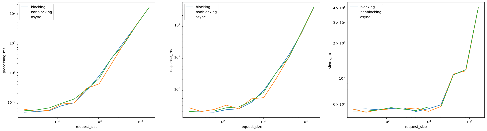
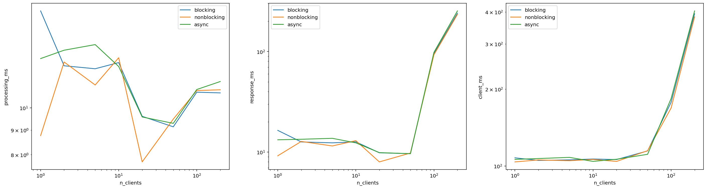
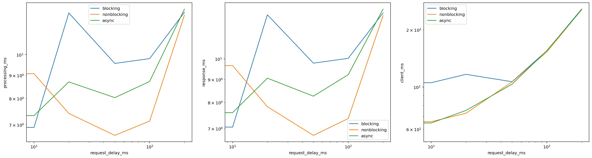
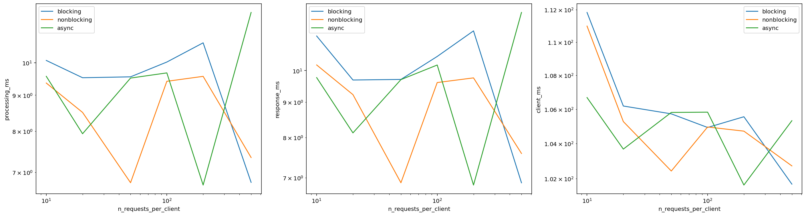

# Домашняя работа на допуск к зачёту по Java

Студент: Суркис Антон Игоревич

## Приложение

Для сборки использовал Maven, клиент и все 3 версии сервера собираются в один jar вместе с зависимостями (protobuf).
Команда для сборки:

```sh
mvn package assembly:single
```

Итоговый jar-файл будет лежать в `target/sem11-java-bonus-1.0-SNAPSHOT-jar-with-dependencies.jar`.

Аргументы для запуска (после `java -jar <путь-до-jar>`):

```
client <адрес сервера> <порт> <размер массива> <задержка между запросами в миллисекундах> <количество запросов>
```

```
blocking/nonblocking/async <порт> <ожидаемое количество клиентов>
```

Для удобства измерений сервер принимает ограниченное количество клиентов, и после их обработки завершает работу.
Это позволяет автоматически дожидаться завершения процесса сервера.

## Измерения

Для измерений я сделал Jupyter Notebook — `experiments.ipynb`.
В нём же построил графики полученных значений.

Результаты измерений расположены в директории `results`.

Графики на основе результатов:









Стоит заметить, что на последнем графике шкала начинается не с 0,
и разница соответствует скорее погрешности измерений.
При этом в теории от количества запросов монотонной зависимости
быть и не должно.

## Вывод

На полученных данных единственная значительная разница
— что клиент наблюдает значительную задержку при частых обращениях
к блокирующему серверу.

Более значимых результатов не наблюдаем,
скорее всего это вызвано тем,
что и сервер, и клиенты запускаются на одном и том же компьютере,
и возможные преимущества и недостатки архитектур нивелируются
тем, что сервером и клиентами управляет один и тот же планировщик процессов,
распределяя ресурсы одного и того же компьютера.
