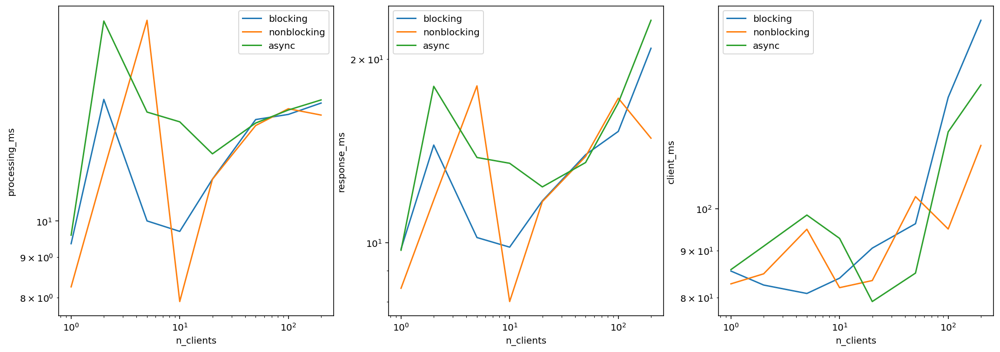

# Домашняя работа на допуск к зачёту по Java

Студент: Суркис Антон Игоревич

## Приложение

Для сборки использовал Maven, клиент и все 3 версии сервера собираются в один jar вместе с зависимостями (protobuf).
Команда для сборки:

```sh
mvn package assembly:single
```

Итоговый jar-файл будет лежать в `target/sem11-java-bonus-1.0-SNAPSHOT-jar-with-dependencies.jar`.

Аргументы для запуска (после `java -jar <путь-до-jar>`):

```
client <адрес сервера> <порт> <размер массива> <задержка между запросами в миллисекундах> <количество запросов>
```

```
blocking/nonblocking/async <порт> <ожидаемое количество клиентов>
```

Для удобства измерений сервер принимает ограниченное количество клиентов, и после их обработки завершает работу.
Это позволяет автоматически дожидаться завершения процесса сервера.

## Измерения

Для измерений я сделал Jupyter Notebook — `experiments.ipynb`.
В нём же построил графики полученных значений.
Для разных компьютеров запускал клиенты через `experiments_client.ipynb`,
для сервера указывал 848 подключений,
затем в `analysis.ipynb` восстанавливал данные и строил графики.

Результаты измерений расположены в директории `results`,
с разных компьютеров — в `results/different_computers`.

Графики на основе результатов с разных компьютеров:





Стоит заметить, что на последнем графике шкала начинается не с 0,
и разница соответствует скорее погрешности измерений.
При этом в теории от количества запросов монотонной зависимости
быть и не должно.

## Вывод

Из полученных данных видно, что при росте размера запроса
уменьшается разница между разными архитектурами,
что ожидаемо, т.к. все 3 архитектуры используют одинаковые тредпулы для непосредственной обработки.

При увеличении количества клиентов в целом немного лучше показывает себя
неблокирующая архитектура, т.к. ей не нужны переключения контекста для
чтения или записи в нескольких подключениях,
но при этом она позволяет одновременно читать запросы и отправлять посчитанные ответы,
в отличие от асинхронной.

Из-за логарифмической шкалы может показаться, что неблокирующая архитектура
показывает себя значительно лучше других при увеличении интервала между запросами,
но в абсолютных значениях разница невелика.

От количества запросов на каждого клиента какой-либо значительной зависимости нет
(скачки на графике — из-за логарифмической шкалы),
т.к. длительность нагрузки не увеличивает её интенсивность.
